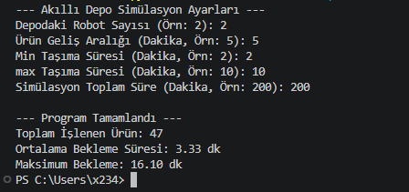
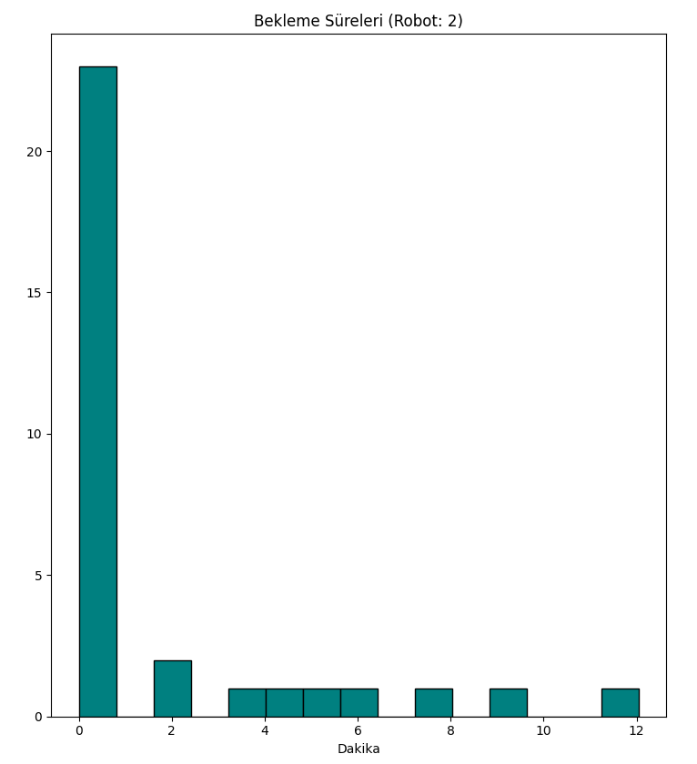
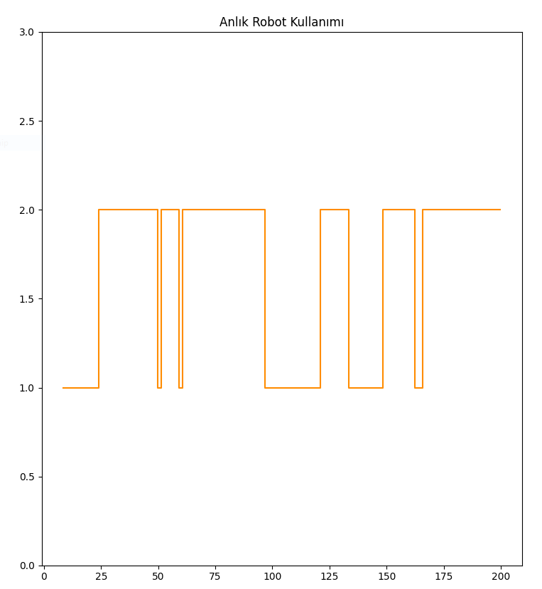

# AKILLI DEPO ROBOT ATAMA SİSTEMİ SİMÜLASYONU ANALİZ RAPORU

## 1. Giriş ve Amaç
Bu çalışma, bir akıllı depo içerisinde farklı ağırlıklara sahip ürünlerin, kendi
ağırlıklarına göre atanmış robotlar tarafından taşınma sürecini
modellemektedir.

**Simülasyonun temel amacı;** belirlenen robot sayıları ve ürün geliş hızları
altında sistemin darboğazlarını tespit etmek, bekleme sürelerini analiz etmek
ve kaynak kullanım verimliliğini ölçmektir.

## 2. Sistem Mimarisi ve Metodoloji

Simülasyon, **Python dili** ve **SimPy** kütüphanesi kullanılarak geliştirilmiştir. Sistem üç ana bileşenden oluşmaktadır:
- Varlıklar (Entities): Hafif (A), Orta (B) ve Ağır (C) ağırlıklara sahip tipindeki ürün veya içinde ürün olan konteynerler.
- Kaynaklar (Resources): Projedeki robotları temsil eder.
- Süreçler:
    - Üretici (Producer): Ürünlerin gelişini üstel dağılıma göre tetikler.
    - Taşıma (Process): Ürünlerin robotlar tarafından taşınmasını uniform dağılıma göre simüle eder.

## Model Parametreleri ve Metodoloji: 
Sistem, Python programlama dili ve `simpy` kütüphanesi kullanılarak modellenmiştir. Modelde kullanılan temel bileşenler şunlardır:

-   **Varlıklar (Entities):** Depoya gelen ürünler.

-   **Kaynaklar (Resources):** Ürünleri taşıyan ve sınırlı sayıda olan robotlar (`simpy.Resource`).

-   **Olaylar (Events):** Ürünlerin rastgele zaman aralıklarıyla gelişi ve taşıma işlemlerinin tamamlanması.

### **Kullanılan Dağılımlar**

-   **Ürün Geliş Aralığı:** **Üstel Dağılım (Exponential Distribution)** kullanılmıştır. Bu, gelişlerin **Poisson Sürecine** uygun olduğunu varsayar.

-   **Taşıma Süresi:** Belirlenen alt ve üst sınırlar dahilinde **Düzgün Dağılım (Uniform Distribution)** kullanılarak modellenmiştir.

## Algoritma Akışı: 
Sistemin çalışma mantığı aşağıdaki adımları izlemektedir:

1.  **Üretici (Producer):** Belirlenen ortalama süreye göre rastgele zamanlarda ürün nesneleri oluşturur.

2.  **Sıralama (Queuing):** Gelen ürün, boşta bir robot olup olmadığını kontrol eder. Eğer tüm robotlar meşgulse, ürün "talep" (request) sırasında bekler.

3.  **İşlem (Processing):** Robot tahsis edildiğinde, taşıma süresi kadar zaman geçer (`yield timeout`).

4.  **Serbest Bırakma (Release):** İşlem bittiğinde robot serbest bırakılır ve sıradaki ürün işleme alınır.

**Performans Göstergeleri (Metrikler):** Raporun en önemli kısmını oluşturan grafiklerin teknik açıklamaları şöyledir:

### **Bekleme Süreleri Dağılımı (Histogram)**

Bu grafik, sistemin hizmet kalitesini ölçer.

-   **Verimlilik Göstergesi:** Histogramın sol tarafa (0'a yakın) yığılması, sistemin akıcı olduğunu gösterir.

-   **Darboğaz Analizi:** Histogramın sağa doğru uzayan bir "kuyruk" (tail) oluşturması, bazı ürünlerin aşırı beklediğini ve sistemin doyuma ulaştığını kanıtlar.

### **Anlık Robot Kullanımı (Step Chart)**

Bu grafik, **kaynak kullanım oranını (Utilization Rate)** analiz eder.

-   **Kapasite Planlama:** Grafiğin sürekli `robot_sayisi` değerinde (tavan çizgisi) seyretmesi, sistemin yetersiz olduğunu ve daha fazla robot yatırımına ihtiyaç duyulduğunu gösterir.

-   **Durağanlık:** Grafikteki dalgalanmalar, sistemin yoğun ve sakin saatlerini ayırt etmemizi sağlar.

## Modül ve Fonksiyon Analizi:

### `def depoyu_calistir()`

Bu fonksiyon, programın **ana kontrol merkezidir (Main Controller)**. Simülasyonun tüm yaşam döngüsü bu fonksiyon içinden yönetilir.

-   **Giriş Parametreleri:** Kullanıcıdan alınan robot sayısı, ürün geliş hızı ve taşıma süreleri gibi dinamik veriler burada toplanır.

-   **Veri Yönetimi:** İstatistiksel analiz için kullanılacak olan `bekleme_sureleri` ve `robot_kullanim_verisi` gibi listeler burada tanımlanır.

-   **Görselleştirme:** Simülasyon bittikten sonra `matplotlib` kütüphanesini çağırarak grafiksel raporu üretir.

### `class AkilliDepo`

Sistemin **fiziksel altyapısını** temsil eden sınıftır. Nesne yönelimli programlama (OOP) mantığıyla oluşturulmuştur.

-   **`__init__(self, env, n_robot)`:** Sınıfın kurucu metodudur. Simülasyon ortamını (`env`) ve kısıtlı kaynak olan robotları (`simpy.Resource`) tanımlar.

-   **`yerlestir(self, urun)`:** Robotun bir ürünü raftaki yerine taşıma eylemini simüle eder. `random.uniform` ile taşıma süresi kadar simülasyon zamanını ilerletir (`yield env.timeout`).

### `def urun_sureci(env, isim, depo)`

Her bir ürün için oluşturulan **bireysel yaşam döngüsü (Process)** fonksiyonudur.

-   **Talep Yönetimi:**`with depo.robotlar.request()` ifadesiyle robotun müsait olmasını bekler. Eğer robotlar doluysa, bu satırda ürün "kuyruğa" girer.

-   **Metrik Hesaplama:** Robotun atandığı andaki zaman ile ürünün geldiği zaman arasındaki farkı alarak **Bekleme Süresini** hesaplar ve listeye ekler.

-   **Süreç Takibi:** Robot kullanımıyla ilgili verileri anlık olarak kayıt altına alır.

### `def uretici(env, depo)`

Sisteme dışarıdan gelen ürün akışını temsil eden **Olay Üretecidir (Event Generator).**

-   **Sonsuz Döngü:**`while True` yapısıyla simülasyon süresi bitene kadar sürekli ürün üretir.

-   **Rastgelelik:**`random.expovariate` fonksiyonu ile ürünlerin geliş zamanlarını "Üstel Dağılım"a göre belirler. Bu, depo kapısından ürün girişlerinin gerçek hayattaki gibi düzensiz (rastgele) olmasını sağlar.

-   **Tetikleme:** Yeni bir ürün oluştuğunda `env.process(urun_sureci(...))` komutuyla o ürünün taşıma sürecini başlatır.

| **Yapı**            | **Türü**            | **Teknik Rolü**                                              |
|-----------------|-----------------|----------------------------------------------------------|
| **AkilliDepo**    | Sınıf (Class)   | Kaynakların (Robot) ve kapasitenin tanımlandığı konteyner. |
| **yerlestir**     | Metot (Method)  | İşlem süresini (Service Time) yöneten eylem.             |
| **uretici**       | Fonksiyon       | Sisteme giriş (Input) sağlayan ana motor.                |
| **urun_sureci**   | Fonksiyon       | Ürünün sistem içindeki tüm mantıksal adımları.           |

## Örnek Kullanım ve Varsayılan Ayarlar ile Değerlendirme:

Programı çalıştırmak için **ADS.py** dosyasını çalıştırıyoruz ve bizden aşağıdaki görüntüdeki gibi girdi isteyecek:

Varsayılan ayarlarla yani aşağıdaki değerleri girdi olarak verdiğimizde simülasyonumuz çalışacaktır.

-   **Depodaki Robot Sayısı:** 2 adet

-   **Ürün Geliş Aralığı:** 5 dakika

-   **Min Taşıma Süresi:** 2 dakika

-   **max Taşıma Süresi:** 10 dakika

-   **Simülasyon Toplam Süre:** 200 dakika

## SİSTEM ANALİZİ VE GRAFİKSEL DEĞERLENDİRME:
Simülasyon çıktıları olarak üretilen grafikler, akıllı depo sisteminin operasyonel verimliliğini gösterir. Bu veriler aşağıdaki şekilde analiz edilmiştir:

### Anlık Kaynak Kullanım Grafiği (Step Chart)

Bu grafik, zaman (x ekseni) boyunca aktif olarak görev yapan robot sayısını (y ekseni) takip etmektedir.

-   **Basamaklı (Discrete) Yapı:** Robotlar tam sayı birimleridir. Grafiğin basamak formunda olması, sistemin kesikli yapısını temsil eder; bir robot ya %100 kapasiteyle çalışmaktadır ya da boştadır.

-   **Doygunluk ve Kapasite Analizi:** Eğer grafik, simülasyon süresinin büyük kısmında maksimum robot kapasite çizgisinde seyrediyorsa, bu durum kaynak yetersizliği'ne işarettir.

-   **Atıl Kapasite (Idle Time):** Grafiğin sıfır noktasına yaklaştığı bölgeler, sistemin düşük yoğunlukta olduğunu ve robotların yeni iş emri beklediği "ölü zamanları" ifade eder.

### Bekleme Süresi Dağılım Analizi (Histogram)

Ürünlerin sisteme giriş anı ile işleme alınma anı arasındaki gecikmeyi ölçen bu grafik, sistemin hızını ve darboğazlarını gösterir.

-   **Sol Yoğunluklu Dağılım:** Sütunların sol tarafta (0-1 dakika bandı) toplanması, sistemin yüksek performansa sahip olduğunu ve ürünlerin bekletilmeden işlendiğini kanıtlar.

-   **Sağ Kuyruk (Uzun Bekleme Süreleri):** Grafiğin sağa doğru uzaması (pozitif çarpıklık), sistemde darboğaz (bottleneck) yaşandığını gösterir. Yoğunluk anlarında bazı ürünlerin ekstrem bekleme sürelerine ulaştığı bu bölgeden anlaşılır.

-   **İstatistiksel Çıkarım:** Veriler incelendiğinde; ürünlerin büyük çoğunluğunun minimum bekleme ile süreci tamamladığı, ancak peak (zirve) saatlerde kuyruk oluştuğu saptanmıştır.

|**Grafik Türü** | **Analiz Edilen Parametre**|**Kararı ve Öneri**|
| --- | --- | --- |
|**Robot Kullanım Grafiği**|Kaynak Doluluk Oranı|Robot sayısı artırılmalı mı yoksa azaltılmalı mı?|
|**Bekleme Histogramı**|Süreç Termin Süresi (Lead Time)|Müşteri memnuniyeti ve işlem hızı yeterli mi?|

**Özet:** Simülasyon sonucunda eğer robot grafiği sürekli üst sınırda, bekleme histogramı ise sağa doğru yayılmışsa; sisteme yeni robot entegrasyonu yapılması operasyonel verimlilik açısından zorunluluk arz etmektedir.
